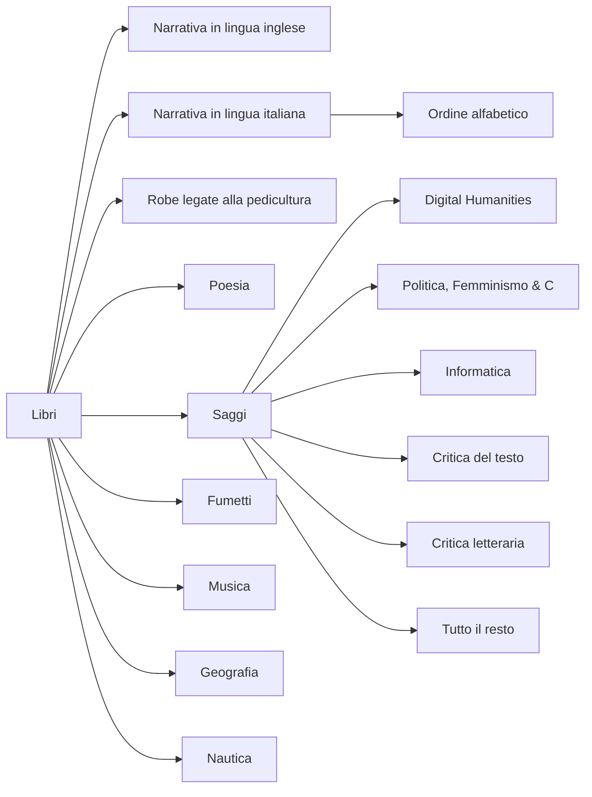

Sull'Amerigo Vespucci, sotto al timone c'è la massima: *Non chi inizia, ma chi
persevera*. Ieri ho deciso di mettere a posto i nostri libri. E oggi ho
perseverato.

Ricorderai bene com'era la casa prima che la lasciassi. I libri avevano preso
il sopravvento sul ogni cosa. Li trovavi ovunque, in cucina, il camera, sulle
scrivanie, per terra. Ti seguivano in bagno. Ti spiavano sotto la doccia.

Ho deciso di riprendere il controllo della situazione. Li ho ammucchiati tutti
nella stanza veranda, per terra, in punizione.

Poi, ho iniziato a dividerli in narrativa in lingua inglese, in lingua
italiana, poesia, fumetti, musica, geografia, nautica, robe per bambini e
saggi. I saggi a loro volta li ho suddivisi in:

- cose legate al digital humanities
- cose legate alla politica
- informatica
- tutto il resto

Li ho quindi divisi tra i vari scaffali in salotto. Ora, sopra alla tua
scrivania c'è tutto il sapere che il genere umano ha potuto scrivere sul digital
humanities. Oltre ad alcune cose di latino, come Barberino ed Egidi. Oltre
alcune cose sulle cortigiane del 500. Ci sono stati pure i meridiani. E
Gramsci.

I fumetti, la musica, la nautica e la geografia (guide, carte, cose così)
stanno dove stavano pure prima.

L'informatica è stata dirottata temporaneamente nella stanza delle teppis.

La narrativa ingese ha una sua sezione negli scaffali. Affianco sta la poesia.
Affianco ancora stanno le cose per bambini.

La narrativa è stata suddivisa in questo modo:

Ho pulito scaffali, ordinato tutto quanto. Insomma, per i prossimi 15 minuti
sarà la stanza più ordinata del mondo. Poi ritornerà, lentamente, il caos
primordiale, che ha dato orgine all'universo e tutto quanto.

Il diagramma dell'ordinamento è quindi il seguente:

Giovedì mattina arriveranno due Billy per risolvere il problema della doppia
fila. Fenomeno frequente nelle città e nelle nostre librerie.

Seguiranno foto, appena capisco come spostarle dalla macchina fotografica al computer. Eh... la tecnologia!
